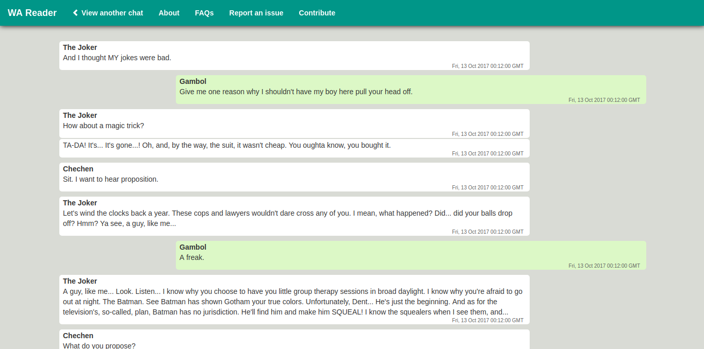

# WA Reader

WA Reader is a platform to read WhatsApp conversations from text backups in a easy-to-read UI. Built on `python-flask` server using `dateutil - powerful extension to datetime`.

## How to use WA Reader
 + Create a backup text file (`.txt file`)of your chat (if you don't have one already)
 + Generate backup file on: [Android](https://www.whatsapp.com/faq/en/android/23756533) | [iPhone](https://faq.whatsapp.com/en/iphone/20888066) | [Windows Phone](https://faq.whatsapp.com/en/wp/23607796)
 + Open [WA Reader](https://whatsapp-reader.herokuapp.com/) and follow the instructions

## Contribute
+ You can find the setup instructions [here](SETUP.md)
+ For reporting bug about an incorrect file not being processed, open a [new issue](https://github.com/prabhakar267/WA-Reader/issues).
+ PRs are always welcome to improve WA-Reader.

## Stargazers over time

> Huge shout out to [@krzysiekh](https://github.com/krzysiekh) for creating the awesome logo we currently have. 