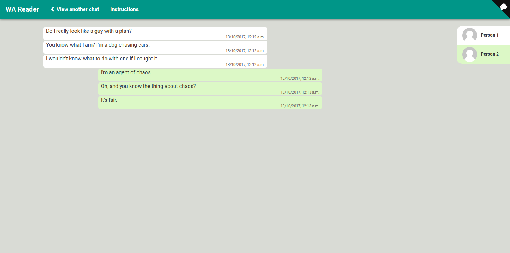

# WA Reader
> WA Reader is a platform to read WhatsApp conversations from **email text backups** in a easy-to-read UI.


## How to use WA Reader
 + Create a backup text file (`.txt file`)of your chat (if you don't have one already)
 + Generate backup file on: [Android](https://www.whatsapp.com/faq/en/android/23756533) | [iPhone](https://faq.whatsapp.com/en/iphone/20888066) | [Windows Phone](https://faq.whatsapp.com/en/wp/23607796) | [Nokia S40](https://faq.whatsapp.com/en/s40/21055286) | [BlackBerry](https://faq.whatsapp.com/en/bb/23574121) | [BlackBerry 10](https://faq.whatsapp.com/en/bb10/27571777)
 + Open [WA Reader](https://whatsapp-reader.herokuapp.com/) and follow the instructions





## View chats locally
 + Clone the project on your local machine

 ```shell
 git clone https://github.com/prabhakar267/WA-Reader.git && cd WA-Reader
 ```

 + Open `index.html` on your browser and follow the instructions


## Other "WhatsApp" and "WhatsApp Web" Hacks
 
 + [WhatsApp Emoticons](https://github.com/prabhakar267/whatsapp-emoticons)

